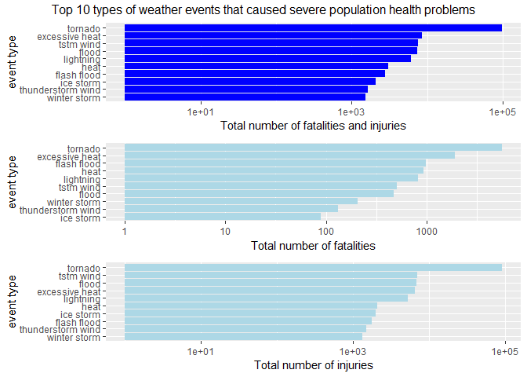
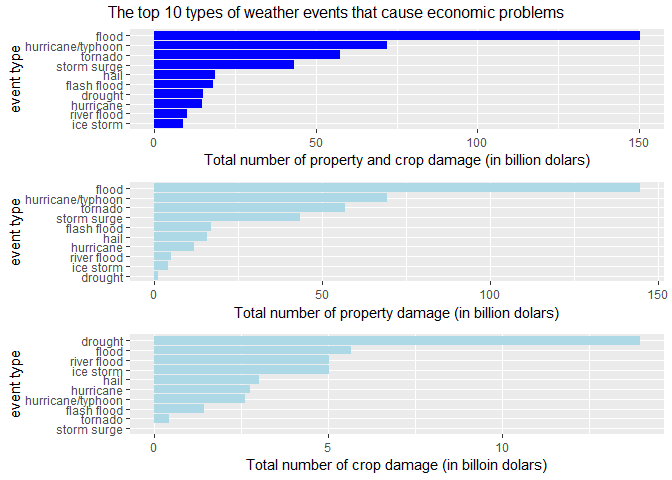

```r
knitr::opts_chunk$set(echo = TRUE)
```

## Synopsis

In this report we aim to figure out the types of weather events that 1) are most
harmful to population health and 2) have the worst economic consequences. To 
investigate these questions, we explored 
the U.S. National Oceanic and Atmospheric Administration's (NOAA) storm database. 
The database recorded measurements for public health and economic consequences with
the estimates of any fatalities, injuries, and property damage.
We found that the tornado was the most harmful to overall public health in the U.S. from
1950 to 2011. It also caused most property damage followed by a flash flood. 
The hail caused most crop damage.

## Downloading files

We obtained the U.S. National Oceanic and Atmospheric Administration's (NOAA) 
storm database. Data are collected from April 1950 to November 2011.


```r
if(!file.exists("./data")) dir.create("data")
download.file("https://d396qusza40orc.cloudfront.net/repdata%2Fdata%2FStormData.csv.bz2",
              "./data/stormData.csv.bz2", mode = "wb")
```

## Data processing

Reading in the data and check the first few rows in the dataset. Missing values 
in the dataset are denoted as empty. After loading the data, we transferred the 
column names and values of evtypes to lower cases.


```r
# loading data
data <- read.csv("./data/stormData.csv.bz2", na.strings = "", stringsAsFactors = FALSE)
dim(data)
```

```
## [1] 902297     37
```

```r
names(data) <- tolower(names(data))
data$evtype <- tolower(data$evtype)
```

The fatalities and injuries columns contain the health measurements. The propdmg
and cropdmg columns contain the economic consequence measurements. The evtype 
column contains event types. Here, we make a brief summary of these columns.


```r
summary(data$fatalities)
```

```
##     Min.  1st Qu.   Median     Mean  3rd Qu.     Max. 
##   0.0000   0.0000   0.0000   0.0168   0.0000 583.0000
```

```r
summary(data$injuries)
```

```
##      Min.   1st Qu.    Median      Mean   3rd Qu.      Max. 
##    0.0000    0.0000    0.0000    0.1557    0.0000 1700.0000
```

```r
summary(data$propdmg)
```

```
##    Min. 1st Qu.  Median    Mean 3rd Qu.    Max. 
##    0.00    0.00    0.00   12.06    0.50 5000.00
```

```r
summary(data$cropdmg)
```

```
##    Min. 1st Qu.  Median    Mean 3rd Qu.    Max. 
##   0.000   0.000   0.000   1.527   0.000 990.000
```

```r
length(unique(data$evtype))
```

```
## [1] 898
```

## Results

### Impacts of Severe Weather Event on Population health

Here, we calculated the sum of fatalities and injuries by each type of events.
Also, we calculated the overall health impact by adding the sum of fatalities and 
injuries together. Then, we selected the top 10 event types with the primary index,
overall health impact, the secondary index, fatalities, and the third index, injuries.  

The figure below showed the top 10 event types that caused the greatest damage to
public health and the corresponding number of people suffered. 
The y-aixs is shown in log10 scale.


```r
library(dplyr)
```

```
## 
## Attaching package: 'dplyr'
```

```
## The following objects are masked from 'package:stats':
## 
##     filter, lag
```

```
## The following objects are masked from 'package:base':
## 
##     intersect, setdiff, setequal, union
```

```r
health <- data %>%
        group_by(evtype) %>%
        summarise(fatalities = sum(fatalities, na.rm = T), 
                  injuries = sum(injuries, na.rm = T),
                  both = fatalities + injuries) %>%
        arrange(desc(both), desc(fatalities), desc(injuries))
health10 <- health[1:10,]

library(ggplot2)
library(gridExtra)
```

```
## Warning: package 'gridExtra' was built under R version 3.5.3
```

```
## 
## Attaching package: 'gridExtra'
```

```
## The following object is masked from 'package:dplyr':
## 
##     combine
```

```r
both <- ggplot(data = health10, aes(reorder(evtype, both), both)) + 
        geom_bar(stat = "identity", fill = "blue") +
        scale_y_log10()+
        coord_flip() +
        labs(y = "Total number of fatalities and injuries", x = "event type") 
fatal <- ggplot(data = health10, aes(reorder(evtype, fatalities), fatalities)) + 
        geom_bar(stat = "identity", fill = "lightblue") +
        scale_y_log10()+
        coord_flip() +
        labs(y = "Total number of fatalities", x = "event type") 
injury <- ggplot(data = health10, aes(reorder(evtype, injuries), injuries)) +
        geom_bar(stat = "identity", fill = "lightblue") +
        scale_y_log10()+
        coord_flip() +
        labs(y = "Total number of injuries", x = "event type") 
grid.arrange(both, fatal, injury, 
             top = "Top 10 types of weather events that caused severe population health problems")
```

<!-- -->

Tornado was most harmful to population health in the U.S. from 1950 to 
2011. as it caused most fatalities and injuries. 
Excessive heat caused the second most fatalities and TSTM wind
caused the second most injuries.

## Impacts of Severe Weather Event on economic damage

Similar to the population health part, we calculated the sum of property 
damage and crop damage as well as the sum of both by each type of events.
Then, we selected the top 10 event types using the primary index,
overall economic damage, the secondary index, property damage, and the third 
index, crop damage.  

The figure below showed the top 10 event types that caused the greatest economic 
damage and the estimates of corresponding damage in dollars. 
The y-axis is shown in log10 scale.


```r
economy <- data %>%
        group_by(evtype) %>%
        summarise(propdmg = sum(propdmg, na.rm = T), 
                  cropdmg = sum(cropdmg, na.rm = T),
                  both = propdmg + cropdmg) %>%
        arrange(desc(both), desc(propdmg), desc(cropdmg))
economy10 <- economy[1:10,]

both <- ggplot(data = economy10, aes(reorder(evtype, both), both)) + 
        geom_bar(stat = "identity", fill = "blue") +
        scale_y_log10()+
        coord_flip() +
        labs(y = "Total number of property and crop damage (in dolars)", x = "event type")
prop <- ggplot(data = economy10, aes(reorder(evtype, propdmg), propdmg)) + 
        geom_bar(stat = "identity", fill = "lightblue") +
        scale_y_log10()+
        coord_flip() +
        labs(y = "Total number of property damage (in dolars)", x = "event type") 
crop <- ggplot(data = economy10, aes(reorder(evtype, cropdmg), cropdmg)) +
        geom_bar(stat = "identity", fill = "lightblue") +
        scale_y_log10()+
        coord_flip() +
        labs(y = "Total number of crop damage (in dolars)", x = "event type") 
grid.arrange(both, prop, crop,
             top = "Top 10 types of weather events that cause severe economic problems")
```

<!-- -->

Tornado caused the greatest property damage and overall economic damage in the U.S. 
from 1950 to 2011. Hail, however, caused the greatest crop damage. Flash flood 
caused the second greatest property and crop damage.
